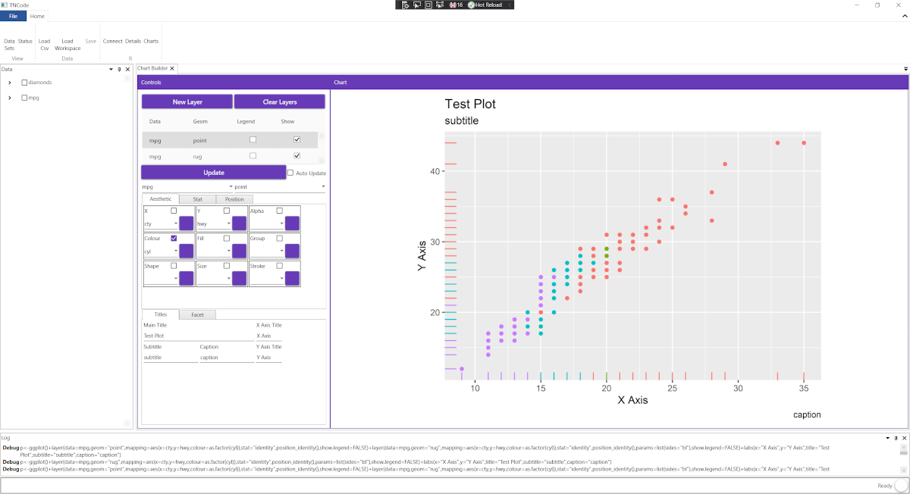

# TNCode

Experimental data analysis platform investigating ways to allow non-programmers to access tools like R without having to code or run scripts. 
Must be flexible enough to ‘easily’ add functions and custom analysis methods. Also want to be able to ‘plug in modules' allowing 
access too many other analysis tools.

Implemented in C# with WPF, Prism and AvalonDock,

R integration using vscode-r, https://github.com/MikhailArkhipov/vscode-r, with the api component reinstated which I've done in a fork, https://github.com/gbull122/vscode-r

# Release

Still fiddling around with the architecture, so very much work in progress, but have been playing around with ideas of getting a GUI for ggplot2.

# Contributing

If you've got a interesting data analysis api that needs a gui or want to help then get in contact.

